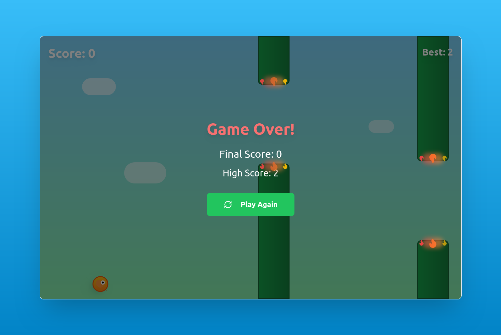

Follow these steps:
Also make sure you have Node (v18+)

```
# Step 1: Clone the repository using the project's Git URL.
git clone https://github.com/nnh12/Flappy-Bird.git

# Step 2: Navigate to the project directory.
cd Flappy-Bird

# Step 3: Install the necessary dependencies.
npm i

# Step 4: Start the development server with auto-reloading and an instant preview.
npm run dev
```

   